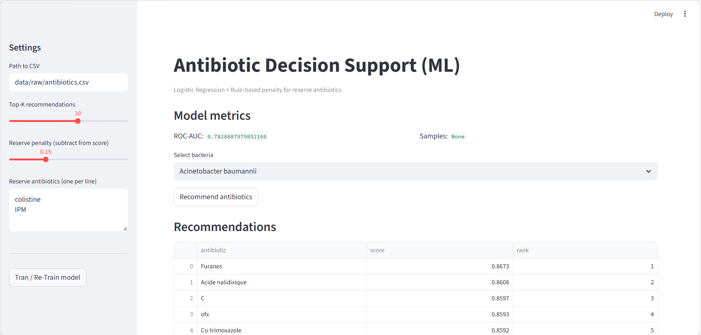

# Antibiotic Decision Support (ML)

Machine Learning application for recommending antibiotics based on bacterial susceptibility data.

Built with **Python, Scikit-Learn and Streamlit**.

⚠️ Educational project for data science portfolio. Not for clinical use.

---

## Project Overview

This project predicts the probability that a bacterium will be **susceptible to a given antibiotic** using historical laboratory data.

The application:

• preprocesses microbiology data  
• trains a Logistic Regression model  
• ranks antibiotics by predicted effectiveness  
• applies a configurable penalty for **reserve antibiotics**

The interface is implemented with **Streamlit**.

---

## Application Interface



---

## How the Model Works

### Data Processing

The pipeline:

1. cleans dataset columns
2. extracts bacteria names
3. normalizes antibiotic susceptibility labels (S / R)
4. converts the dataset into **long format**

Resulting dataset structure:

```
bacteria | antibiotic | susceptible
```

---

### Model

Model used:

**Logistic Regression**

For each antibiotic the model predicts:

```
P(susceptible)
```

Final ranking score:

```
score = mean(P(susceptible)) − reserve_penalty
```

Reserve antibiotics (e.g. **colistin, carbapenems**) can receive a penalty to avoid recommending them unless necessary.

---

## Streamlit Features

The interface allows:

• selecting bacteria species  
• adjusting **Top-K recommendations**  
• setting **reserve antibiotic penalties**  
• retraining the model directly in the UI

---

## Project Structure

```
antibiotic_decision_support_ml
│
├── app
│   └── streamlit_app.py
│
├── src
│   ├── data_prep.py
│   ├── model.py
│   └── recommender.py
│
├── data
│   └── raw
│
├── assets
│   └── screenshot_app.png
│
├── requirements.txt
└── README.md
```

---

## Installation

Clone the repository

```
git clone https://github.com/Lidpvs/antibiotic_decision_support_ml.git
```

Create environment

```
python -m venv .venv
```

Activate

Windows

```
.venv\Scripts\activate
```

Install dependencies

```
pip install -r requirements.txt
```

---

## Run the App

```
streamlit run app/streamlit_app.py
```

Open:

```
http://localhost:8501
```

---

## Future Improvements

• patient-level features (age, comorbidities)  
• better train/test evaluation  
• model persistence  
• deployment to Streamlit Cloud  

---

## Tech Stack

Python  
Pandas  
Scikit-Learn  
Streamlit  
NumPy  

---

## Author

Data Science / ML portfolio project
